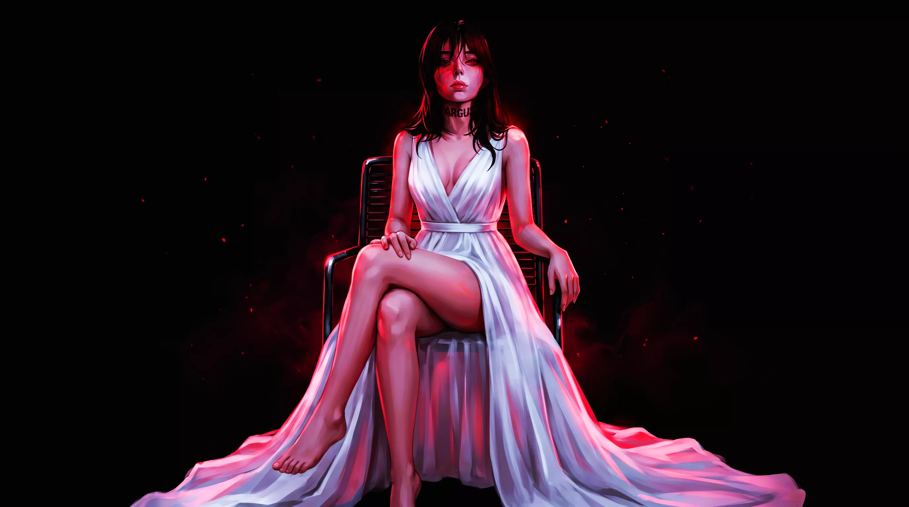

# ARGUS — Deployment Report

Landing page + documentation bundle, ready to publish on GitHub Pages.

- **Page:** `index.html` (single file — all CSS and JS inline, no build step)
- **Book:** `english/` and `persian/` (GitBook source, 49 pages each)
- **Host:** GitHub Pages, deployed from the repository root

---

## 1. Repository Structure

```
<repo root>/
├── index.html              landing page (single file)
├── .nojekyll               empty — tells Pages to skip Jekyll
├── README.md               book intro + Pages setup notes
├── SUMMARY.md              GitBook table of contents
├── .gitbook.yaml           GitBook config (readme / summary)
├── DEPLOYMENT.md           this report
├── english/                book, English (49 pages)
├── persian/                book, Persian (49 pages)
└── assets/
    ├── fonts/
    │   ├── Vazirmatn-Black.ttf
    │   ├── Vazirmatn-ExtraBold.ttf
    │   ├── Vazirmatn-Bold.ttf
    │   ├── Vazirmatn-SemiBold.ttf
    │   ├── Vazirmatn-Medium.ttf
    │   ├── Vazirmatn-Regular.ttf
    │   ├── Vazirmatn-Light.ttf
    │   ├── Vazirmatn-ExtraLight.ttf
    │   ├── Vazirmatn-Thin.ttf
    │   ├── SpaceGrotesk-Bold.ttf
    │   ├── SpaceGrotesk-SemiBold.ttf
    │   ├── SpaceGrotesk-Medium.ttf
    │   ├── SpaceGrotesk-Regular.ttf
    │   └── SpaceGrotesk-Light.ttf
    ├── argus-hero.webp
    ├── argus-portrait.webp
    └── argus-face.webp
```

**Notes**

- All three character images ship as **WebP** (`.webp`), not PNG.
- `favicon.ico` is referenced by `index.html`; add it to `assets/` when available.
- Every path in `index.html` is relative (`./assets/...`), so the page works at
  any URL depth on GitHub Pages without a base-path setting.
- No `.png` references remain anywhere in the HTML, CSS, or JavaScript.

---

## 2. How to Update Fonts and Images

### Fonts

Fonts live in `assets/fonts/` and are declared with `@font-face` at the top of
the `<style>` block in `index.html`. Fourteen files are referenced:

| Family | Files | Role |
|---|---|---|
| **Vazirmatn** | `Vazirmatn-Thin` … `Vazirmatn-Black` (9 weights) | Persian display + body |
| **Space Grotesk** | `SpaceGrotesk-Light` … `SpaceGrotesk-Bold` (5 weights) | English display + body |
| **JetBrains Mono** | *not local* — Google Fonts | Code / CLI output, both languages |

To replace a font:

1. Drop the new `.ttf` into `assets/fonts/`.
2. Update the matching `@font-face` rule in `index.html`:
   ```css
   @font-face { font-family: 'Vazirmatn'; src: url('./assets/fonts/Vazirmatn-Bold.ttf') format('truetype'); font-weight: 700; font-display: swap; }
   ```
3. Keep `font-display: swap` on every rule so text paints immediately with the
   fallback face instead of going invisible while the font loads.

The language switch is driven by the `html[lang="en"]` / `html[lang="fa"]` CSS
variable blocks — swap the family names there to change a whole language at once.

### Images

**All image assets are in WebP format.** The three character images are
`argus-hero.webp`, `argus-portrait.webp`, and `argus-face.webp`.

To replace an image:

1. Export the new image as **WebP** (quality ~80–85 is a good default).
2. Name it to match the existing reference and drop it into `assets/`.
3. If the filename changes, update the `` in `index.html`:
   ```html
   
   ```
4. Keep the `onerror="this.style.display='none'"` attribute — it lets the page
   degrade gracefully if an image is missing instead of showing a broken icon.

Images are referenced from three places: the hero background
(`argus-hero.webp`) and the two gallery slots plus a third gallery tile
(`argus-portrait.webp`, `argus-face.webp`, `argus-hero.webp`).

### Why WebP

WebP produces files **25–35% smaller than PNG at the same visual quality**, and
it is supported by all modern browsers. That means a faster page load with no
visible loss of quality — which matters most for the hero background, the first
thing a visitor downloads. All three character images (hero, portrait, face) are
served as WebP.

---

## 3. Footer and Pixel Animation

### Footer tagline

The footer carries the ARGUS tagline in **English, always**:

```html
<p class="tagline">ARGUS — Written at the syscall. A deleted block is still evidence.</p>
<p class="signature">Gneo HZSB · 2026</p>
```

These two lines are **not translated**. They carry no `data-en` / `data-fa`
attributes, so the language toggle never rewrites them, and dedicated
`html[lang="fa"] footer .tagline` / `html[lang="fa"] footer .signature` rules
pin them to Space Grotesk even in Persian mode. Styling: a slow 4-second
`footerPulse` text-shadow, a 0.25em-tracked uppercase signature, and a subtle
red scanline gradient behind the whole footer (`footer.footer::before`).

### Pixel ARGUS character

A section sits between the CLI preview and the footer:

- Title — EN `She watches.` / FA `او تماشا می‌کند.`
- A `<canvas id="argusPixels">` element, **64×64 logical pixels**, upscaled by
  CSS to 400px with `image-rendering: pixelated` (each logical pixel ≈ 6 screen
  pixels)
- Below it, an English-only caption: `One hundred eyes. Watching.`

The character is **drawn programmatically**, pixel by pixel, with `ctx.fillRect()`
calls. No image is loaded, no SVG is used, and no external library is imported.
The palette is limited to the seventeen colours defined in the script's `C` object
(blood red, eye blue, pale skin, white dress, katana steel, and their shadows).

She is a bust portrait matching the hero artwork: long dark hair with a parted
fringe and a red sheen, pale skin with heavy brows, a **blue left eye** and a
**red right eye**, the ARGUS mark on her neck, bare shoulders, and a draped white
**V-neck wrap dress** with a red rim light down the right side.

### The katana

She holds a katana upright at her right side, gripped in her right hand. It is
drawn as flat pixel columns:

| Part | Geometry |
|---|---|
| Blade | 3 px wide × 36 px tall, with a bright core and a glowing red edge |
| Guard (tsuba) | 9 × 2 px bar just below the blade |
| Grip (tsuka) | 3 × 13 px column with four red wrap bands |
| Hand | forearm + fist drawn over the grip, with finger and thumb shading |

The blade sits at `kx = 44` and the whole bust is shifted 3 px left (`SX = -3`),
so the sword and the body never collide. During `swordRaise` the blade lifts up
to 3 px, which is why the rest position starts at `y = 9` — the tip stays at
`y = 6` at full lift, just inside the pulsing border. Every drawn pixel stays
inside the content box (`x` 13–49, `y` 6–61); the border sits at `x` 12/50 and
`y` 5/62.

### Animations

Three **ambient** loops run continuously:

| Ambient | Cycle |
|---|---|
| Hair sway (±1 px) | 2 s sine period |
| Red border pulse | 3 s |
| Scanline sweep (top → bottom) | 6 s |

Eight **gestures** play one at a time — the avatar picks one, plays it, then waits
before choosing the next:

| Gesture | What it does | Duration | Weight |
|---|---|---|---|
| `blink` | both eyes close | 160 ms | 4 |
| `wink` | right eye closes | 340 ms | 3 |
| `headLeft` | head + hair shift 1 px left (the katana stays put) | 850 ms | 2 |
| `headRight` | head + hair shift 1 px right | 850 ms | 2 |
| `browRaise` | both brows lift 1 px | 750 ms | 2 |
| `swordRaise` | blade lifts 3 px and settles | 1.10 s | 2 |
| `glint` | a light streak runs down the blade | 800 ms | 3 |
| `glowSurge` | the border flares | 1.20 s | 1 |

**Scheduling is random, not cyclic.** On each turn the avatar draws a gesture
weighted by the table above, plays it once, then idles for a random 0.9–3.5 s
before the next pick. There is no fixed period, so the loop never reads as a
metronome.

**Performance and accessibility**

- Animation runs at **12 fps** on `requestAnimationFrame` — the frame gate means
  the draw function is skipped on most ticks, so the main thread is never blocked.
- An `IntersectionObserver` stops drawing when the canvas scrolls out of view,
  and drawing is also skipped while the tab is hidden.
- With `prefers-reduced-motion: reduce`, the animation loop never starts. The
  character is painted exactly once, on frame 0 — both eyes open, katana at rest.

**To modify the pixel art:** edit the `draw()` function directly in `index.html`.
Each body part is a short sequence of `rect(x, y, w, h, colour)` calls — change
the coordinates to move a feature, or the colour constant to recolour it. To add
or retune a gesture, edit the `GESTURES` array: `w` sets how often it is chosen
and `d` its duration, then handle the new name in the gesture-modifier block at
the top of `draw()`. There is no sprite sheet and no build step.

---

## 4. Deploying to GitHub Pages

1. Push this folder to a GitHub repository with `index.html` at the root.
2. Open the repository → **Settings → Pages**.
3. Under **Build and deployment**, set **Source = Deploy from a branch**.
4. Set **Branch = `main`** (or `master`) and **Folder = `/ (root)`**. Save.
5. Wait about a minute. The site is served at
   `https://<user>.github.io/<repo>/`.

An empty `.nojekyll` file is included at the root. GitHub Pages runs every file
through Jekyll by default, and Jekyll silently drops any file or folder whose
name begins with an underscore. `.nojekyll` disables that, so the page is served
exactly as committed.

---

## 5. Troubleshooting

| Problem | Cause | Fix |
|---------|-------|-----|
| Image does not display in old browser | WebP not supported | Use a modern browser (Chrome 32+, Firefox 65+, Safari 14+, Edge 18+) |
| Pixel character is blank | `prefers-reduced-motion: reduce` is set at the OS level | Expected — the animation freezes on frame 0 rather than disappearing |
| Pixel character is blurry, not sharp | `image-rendering: pixelated` overridden or dropped | Keep the CSS rule on `#argusPixels`; do not scale the canvas with a transform |
| Gestures change order on every visit | Weighted-random scheduler (by design) | Expected — there is no fixed cycle; the avatar picks each gesture at random |
| Katana overlaps the body or the border | Blade moved without shifting the bust, or `SX` removed | Keep `kx = 44` and `SX = -3`; content must stay inside `x` 13–49, `y` 6–61 |
| Footer tagline appears in Persian | A `data-fa` attribute was added to `.tagline` / `.signature` | Remove it — those two lines must stay English-only |
| Site shows the README instead of the landing page | `index.html` missing from the repo root | Move `index.html` to the repository root and re-deploy |
| Page renders but assets 404 | Absolute paths or a moved `assets/` folder | Keep every path relative (`./assets/...`) and keep `assets/` beside `index.html` |
| A file or folder disappears after deploy | Jekyll dropped an underscore-prefixed name | Confirm `.nojekyll` exists at the repository root |
| Persian text renders in a fallback font | `Vazirmatn` files missing from `assets/fonts/` | Upload all nine Vazirmatn `.ttf` files; check the browser console for failed font requests |
| Code block renders in a proportional font | Google Fonts blocked or offline | JetBrains Mono falls back to `Courier New`, then `monospace` — the layout still holds |
| Toggle does not persist across reloads | `localStorage` disabled (private mode / strict privacy) | Expected — the page falls back to English each visit |
| Layout does not mirror in Persian | JavaScript blocked | The toggle needs JS; `dir="rtl"` is applied by the toggle handler |

---

## 6. Verification Checklist

- [x] Single `index.html`, no build step, no framework
- [x] 14 `@font-face` rules, all with `font-display: swap`, all from `./assets/fonts/*.ttf`
- [x] English → Space Grotesk; Persian → Vazirmatn; code → JetBrains Mono in both
- [x] Persian body text uses `line-height: 2.0`, `font-weight: 500`, `letter-spacing: 0`
- [x] English logo tracking `0.22em`; Persian logo tracking `0`
- [x] All `` tags point to `./assets/*.webp` — zero `.png` references
- [x] Footer tagline and signature are English-only, with no `data-en` / `data-fa`
- [x] Pixel ARGUS drawn entirely with `ctx.fillRect()` — no image, no SVG, no library
- [x] Katana held in the right hand; bust shifted left (`SX = -3`) so blade and body never collide
- [x] 8 gestures run automatically and at random (weighted); no fixed cycle
- [x] Every drawn pixel stays inside the content box (`x` 13–49, `y` 6–61)
- [x] Pixel animation runs at 12 fps and freezes on frame 0 under `prefers-reduced-motion`
- [x] EN/FA toggle with `localStorage` persistence, default English
- [x] Only external request: Google Fonts (JetBrains Mono)
- [x] `.nojekyll` present at the repository root
- [x] Responsive at 375px / 768px / 1440px+

---

*ARGUS — Written at the syscall. A deleted block is still evidence.*
*Gneo HZSB · 2026*
